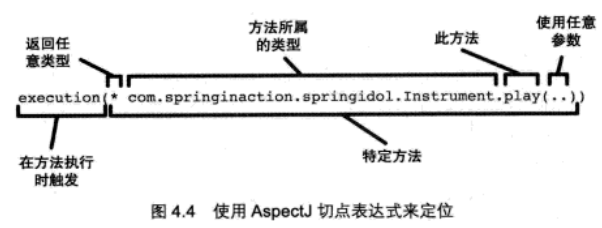

####Spring AOP的目的是为了解耦
    AOP弥补了OOP的不足，为分散的对象引入公共行为(即封装复用了公共行为)
    Spring支持AspectJ的注解是切面编程
    (1)使用@Aspect声明一个切面
    (2)使用@After、@Before、@Around定义advice，可直接将拦截规则(切点)作为参数
    (3)为了切点的复用，使用@PointCut专门定义切点
####术语

#####切面(Aspect)
    切面就是在怎样的环境中工作，横切多个对象
    切面包含通知和切点
    通知说明了干什么和什么时候干，而切点说明了在哪干（指定到底是哪个方法），这就是一个完整的切面定义。
    切面在动态代理中可以理解成拦截器
#####连接点(JoinPoint)
    连接点是在应用执行过程中**能够**插入切面的一个点。
    连接点是所有可能被织入通知的点
    是一个辅助理解切点的概念。
#####切点(Pointcut)
    一个切面并不需要通知应用的所有连接点，切点有助于缩小切面所通知的连接点范围。
    如果说通知定义了切面的“干什么”和“何时干”的话，那么切点就定义了“何处”。
    因此，切点其实就是定义了需要执行在哪些连接点上执行通知。
    
    切点是一个描述信息, 它修饰的是连接点
    切点的作用就是提供一组规则来匹配连接点
    切点是一系列需要通知的连接点的集合
#####通知(Advice)    
    通知是切面里的具体方法来提供具体功能
    前置通知(before)、后置通知(after)、返回通知(afterReturning)、异常通知(afterThrowing)、环绕通知(around)
    
    环绕通知是Spring AOP中最强大的通知，它可以同时实现前置通知和后置通知，它可以拿到被代理对象的原有方法。如果不是大量改变业务逻辑不建议使用。
    环绕通知就是把被代理对象的原方法完全包裹起来。
#####织入(Weaving)
    织入是把切面应用到目标对象生成代理的过程，Spirng是使用动态代理
#####引入(Introduction)
    在现有类里添加新的方法和属性
#####目标对象(Target)
    织入通知的目标对象，即被代理对象
    
####AOP的两类实现方式
    一是采用动态代理技术，利用截取消息的方式，对该消息进行装饰，以取代原有对象行为的执行；
    二是采用静态织入的方式，引入特定的语法创建“切面”，从而使得编译器可以在编译期间织入有关“切面”的代码。
    
    Spring中对AOP的支持是基于动态代理
    
####应用场景
    Authentication 权限
    
    Caching 缓存
    
    Context passing 内容传递
    
    Error handling 错误处理
    
    Lazy loading　懒加载
    
    Debugging　　调试
    
    logging, tracing, profiling and monitoring　记录跟踪　优化　校准
    
    Performance optimization　性能优化
    
    Persistence　　持久化
    
    Resource pooling　资源池
    
    Synchronization　同步
    
    Transactions 事务
####具体例子
    @Transactional就是使用注解式拦截的AOP实现，基于动态代理，实现事务支持
    
####AspectJ的切点指示器
    ①使用@annotation限制匹配带有指定注解的连接点
        @annotation(AOP.Action)
    ②使用切点表达式来定位切点

    