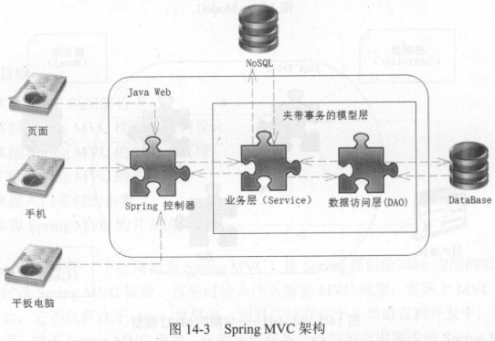
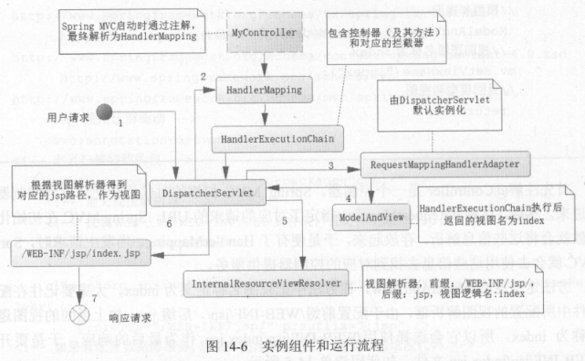

### 三层架构

​    表现层(UI)、业务逻辑层(Service)、数据访问层(Dao)
​    

    实体层(Entity)   贯穿于三层，在三层之间传输数据
    
    三层架构的目的：解耦
    
    三层架构是整个应用的框架
    MVC模式是应用于三层架构的表现层的模式
### MVC模式

    Model 模型
    一个个功能。用javaBean实现，包括两类Bean：
    处理业务逻辑（封装业务逻辑的JavaBean）
    处理数据（封装数据的JavaBean）    
    
    View 视图(指视图页面)
    用户可见的，用于展示以及与用户交互。使用各种前端技术，模板引擎、JSP等
    界面展示、人机交互
    
    Controller 控制器/分发器
    Controller接收请求，然后调度Model进行处理，Model处理完后将结果返回给Controller，Controller再将结果交给View渲染。一般使用Servlet。
    视图、模型的选择（分发）
    Controller的作用就是将Model和View进行关联

### Spring MVC

    Spring MVC是表现层框架
    Spring MVC是一种基于Servlet的技术
    Spring MVC将传统的模型层拆分为业务层(Service)和数据访问层(DAO)
    在Spring MVC中可以使用各种视图
   

### Spring MVC组件与流程
   
    
    部分组件介绍：
    处理器映射：SpringMVC初始化时，通过注解(@Controller、@RequestMapping)解析生成HandlerMapping(处理器映射)
    处理器执行链：SpringMVC会给处理器加入拦截器，在处理器执行前后加入代码，构成处理器的执行链(HandlerExecutionChain)-------责任链模式
    处理器适配器:因为处理器执行链会在不同的上下文中运行，通过上下文找到适配器，用来运行处理器执行链。适配器的实例在DispatcherServlet初始化的时候创建
    视图解析器：非逻辑视图不会被视图解析器解析
    
    流程分析：
    请求由DispatcherServlet接收处理
    DispatcherServlet根据URL在HandlerMapping中找到对应的处理器，生成处理器的执行链
    DispatcherServlet再将该执行链拿到适配器(Adapter)去执行，返回视图(逻辑视图)
    DispatcherServlet将视图拿给视图解析器解析，返回解析结果

​    