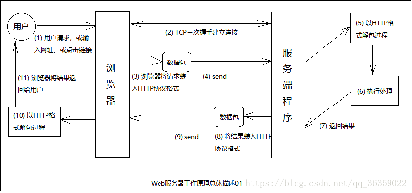

####HTTP
    HTTP是一个无状态的面向连接的协议
####URL
    URL全称是统一资源定位符
    Url的编码格式采用的是ASCII码，所有非ASCII字符均需要编码再传输
####Http请求和Http响应
    Http请求
    <request line>
    <headers>
    <blank line>
    <request-body>
    
    Http响应
    <status line>
    <headers>
    <blank line>
    <response-body>
    
    在响应中唯一真正的区别在于第一行中用状态信息代替了请求信息
    状态行（status line）通过提供一个状态码来说明所请求的资源情况。 

    常用状态码：    
    ◆200 (OK): 找到了该资源，并且一切正常。
    ◆304 (NOT MODIFIED): 该资源在上次请求之后没有任何修改。这通常用于浏览器的缓存机制。
    ◆401 (UNAUTHORIZED): 客户端无权访问该资源。这通常会使得浏览器要求用户输入用户名和密码，以登录到服务器。
    ◆403 (FORBIDDEN): 客户端未能获得授权。这通常是在401之后输入了不正确的用户名或密码。
    ◆404 (NOT FOUND): 在指定的位置不存在所申请的资源。
   
   
   
####[GET和POST的区别](https://blog.csdn.net/gideal_wang/article/details/4316691)
[GET和POST比较](https://www.w3school.com.cn/tags/html_ref_httpmethods.asp)

    GET一般用于获取/查询资源信息，而POST一般用于更新资源信息，这是HTTP规范，但实际做的时候很多人
    没有完全按照这个规范来，很多人贪方便，更新资源时用了GET，因为用POST必须要到FORM（表单），这样会麻烦一点。
    
    GET方法幂等（幂等：对同一URL的多个请求应该返回同样的结果）
    
    在FORM提交中，默认为GET提交。
    
    GET请求示例：
    GET /books/?sex=man&name=Professional HTTP/1.1
    Host: www.wrox.com
    User-Agent: Mozilla/5.0 (Windows; U; Windows NT 5.1; en-US; rv:1.7.6)
    Gecko/20050225 Firefox/1.0.1
    Connection: Keep-Alive
    
    POST请求示例：
    POST / HTTP/1.1
    Host: www.wrox.com
    User-Agent: Mozilla/5.0 (Windows; U; Windows NT 5.1; en-US; rv:1.7.6)
    Gecko/20050225 Firefox/1.0.1
    Content-Type: application/x-www-form-urlencoded
    Content-Length: 40
    Connection: Keep-Alive
    （空行）
    name=Professional%20Ajax&publisher=Wiley
    
    GET提交，请求的数据会附在URL之后，明文；POST提交，把提交的数据放置在是HTTP包的包体(request-body)中
    传输数据大小：HTTP协议没有对传输的数据大小进行限制，HTTP协议规范也没有对URL长度进行限制。
                 GET：特定的浏览器、服务器甚至操作系统对这方面有限制
                 POST：一般服务器会限制
                 通常GET比POST能传输的数据要小很多
    GET和POST请求参数都是键值对
####Restful API
[详解1](https://blog.csdn.net/hjc1984117/article/details/77334616)
[详解2](https://blog.csdn.net/qq_21383435/article/details/80032375)

    REST(Representational State Transfer)，一套支持HTTP规范的新风格
    用HTTP动词（GET,POST,PUT,DELETE)描述操作
    
    统一接口，通过HTTP方法来区分操作：
    GET（SELECT）：从服务器取出资源（一项或多项）。//查
    POST（CREATE）：在服务器新建一个资源，更新资源。//增
    PUT（UPDATE）：在服务器更新资源（客户端提供完整资源数据）。//改
    PATCH（UPDATE）：在服务器更新资源（客户端提供需要修改的资源数据）。//不常用
    DELETE（DELETE）：从服务器删除资源。//删
    
    url中没有动词
####Web服务器
   
    