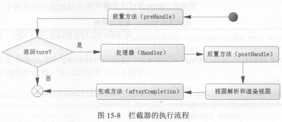

####拦截器
    拦截器是 AOP 编程思想的典型应用
    
    Spring中要求处理器的拦截器都要实现接口HandlerInterceptor
    preHandle          处理器执行之前的前置方法
    postHandle         处理器执行完之后执行的后置方法
    afterCompletion    无论是否产生异常都会在渲染视图后执行的方法
    
   
####SpringMVC的Interceptor与Servlet的Filter

    拦截器和过滤器执行顺序：
    1、Filter.init();
    2、Filter.doFilter(); before doFilter
    3、HandlerInterceptor.preHandle();
    4、Controller方法执行
    5、HandlerInterceptor.postHandle();
    6、DispatcherServlet视图渲染
    7、HandlerInterceptor.afterCompletion();
    8、Filter.doFilter(); after doFilter
    9、Filter.destroy();