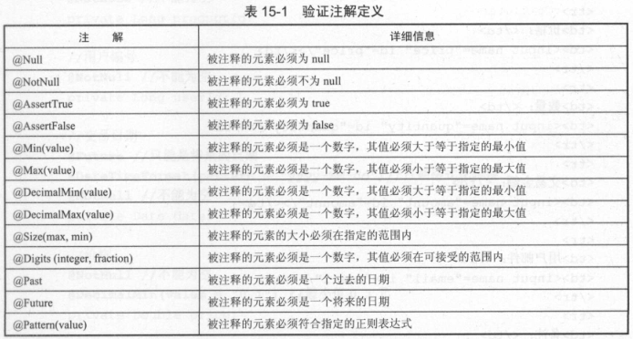

####部分常用注解
    @RequestMapping       默认是GET方法
    @RequestAttribute     获取request设置的attribute     默认不能为空
    @SessionAttribute     获取session设置的attribute     默认不能为空
    @SessionAttributes    设置会话属性(键值对)，只能注解类
    @CookieValue          获取Cookie中的值
    @RequestHeader        获取请求头信息中的值
####验证表单(以下两种方式不能同时使用)
#####使用JSR 303注解验证输入内容
    注解验证，验证顺序是无序的
    @Valid     注解在输入参数上，标明启用注解式验证
    
    验证注解，注解在Bean的成员变量上：
   
#####自定义验证器

HandlerExceptionResolver
    https://blog.csdn.net/KingBoyWorld/article/details/78934841
    https://blog.csdn.net/kobejayandy/article/details/12690555