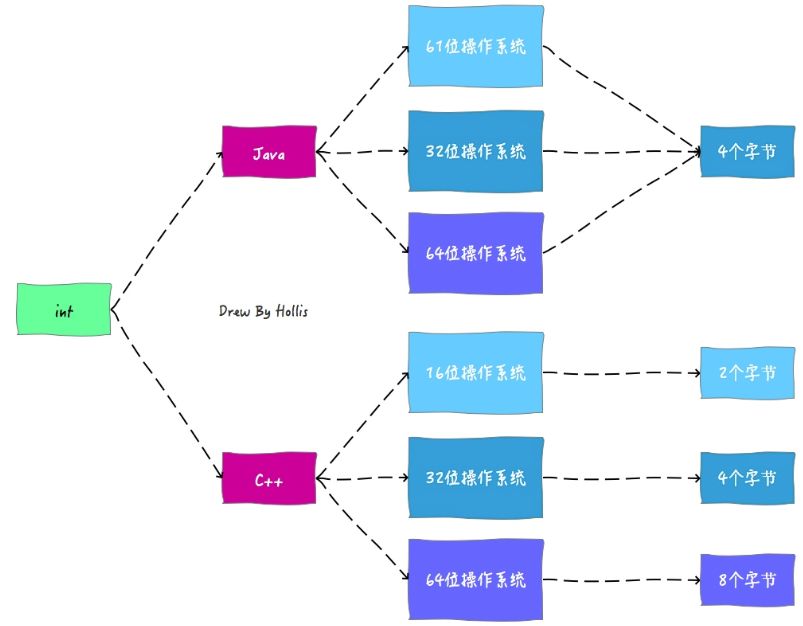

#### 创建类实例的三种方式

1. new
2. 反射
3. 反序列化

#### volatile关键字

1.volatile是一个类型修饰符，它是被设计用来修饰被不同线程访问和修改的变量。

2.被volatile类型定义的变量，系统每次用到它时，都是直接从对应的内存中提取，而不会利用缓存。这样就防止了多线程操作同一变量时，所产生的不一致性。

3.在使用了volatile修饰成员变量后，所有线程在任何时候所看到的变量的值都是相同的。

#### Java语言规范

Java中基本数据类型的值域和行为都是由其自己定义的。而C/C++中，基本数据类型是由它的占位宽度决定的，占位宽度则是由所在平台决定的。所以，在不同的平台中，对于同一个C++程序的编译结果会出现不同的行为。

通过保证基本数据类型在所有平台的一致性，Java语言为平台无关性提供强了有力的支持。

#### JVM语言无关性

只要能编译出Class文件，就可以被JVM解释成机器码执行。目前支持10种语言。

#### Java中只有值传递

